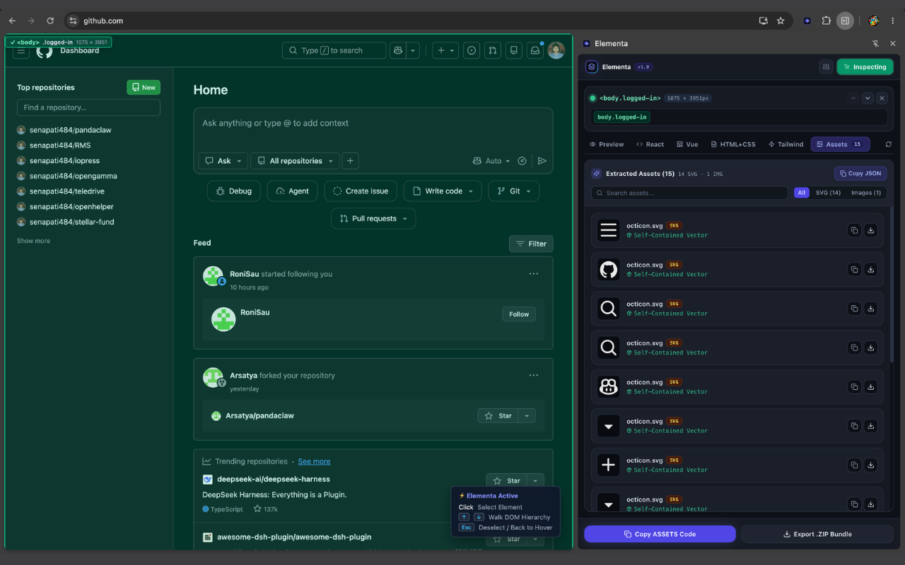
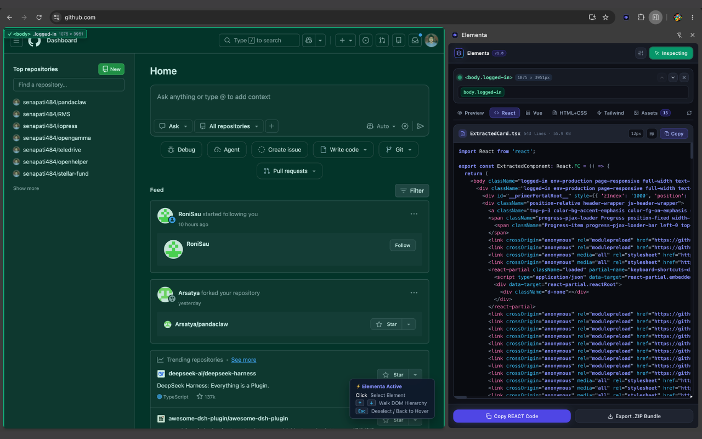
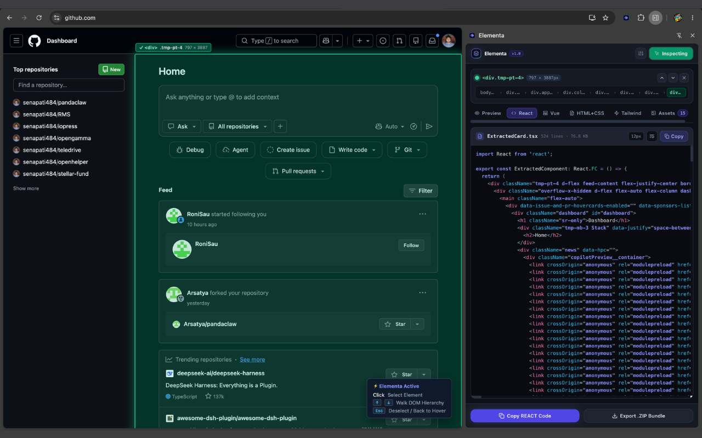
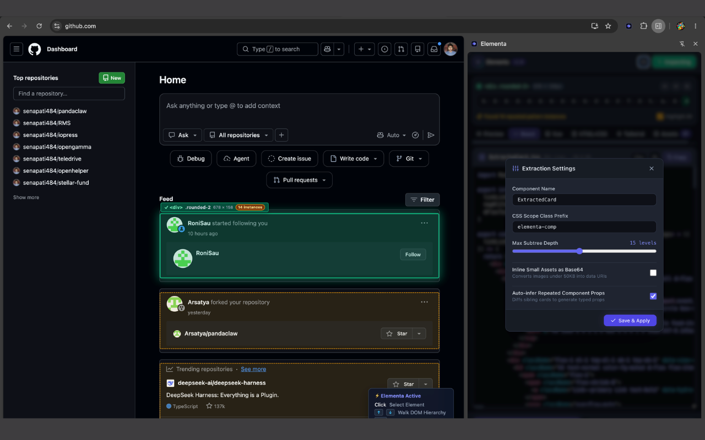
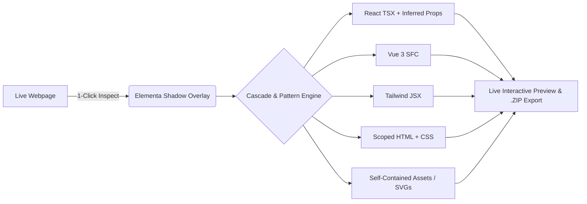

<div align="center">


# Elementa

### **Instant DOM-to-Component Studio for Chrome**

*Transform any live UI element on the web into production-ready React (TSX), Vue 3 (SFC), Tailwind JSX, and Scoped HTML+CSS in one click.*

[](https://developer.chrome.com/docs/extensions/mv3/intro/)
[](https://reactjs.org/)
[](https://vuejs.org/)
[](https://www.typescriptlang.org/)
[](https://tailwindcss.com/)
[](https://crxjs.dev/)
[](https://vitest.dev/)
[](LICENSE)

</div>

---

## 📸 Product Screenshots & Live Demo

<div align="center">

### 1. Precision Element Inspection & Hover Tracking
*Non-invasive Shadow DOM bounding boxes track any component live on the page without layout shifts or style contamination.*



<br/><br/>

### 2. Multi-Format Code Generation (React TSX, Vue SFC, Tailwind JSX)
*Synchronous code generation with inferred dynamic TypeScript props, scoped CSS class isolation, and syntax highlighting.*



<br/><br/>

### 3. High-Fidelity Asset & SVG Vector Extraction
*Resolves inline SVGs into self-contained vector assets and downloads external CDN images with zero CORS errors.*



<br/><br/>

### 4. Interactive Live Studio Preview & Responsive Viewports
*Test extracted components in a sandboxed iframe with Mobile (375px), Tablet (640px), and Full Width presets across Dark/Light/Grid studio canvases.*



</div>

---

## 🌟 Why Elementa?

Reverse-engineering frontend components from live websites is usually painful:
- Browser DevTools give you un-scoped, messy CSS rules scattered across 20+ stylesheets.
- CSS variables (`var(--...)`) are unresolved and break when pasted into your codebase.
- Repeated list items and grid cards have hardcoded text instead of clean dynamic TypeScript props.
- Inline SVGs break due to missing `<use xlink:href>` symbol definitions.
- Images and avatars fail with CORS errors when downloaded or inlined.

**Elementa solves all of this automatically.** With a single click, it isolates the subtree, resolves true cascade specificity, strips CSS-in-JS hashes, infers typed props, extracts vector assets, and previews the result in a live sandboxed studio.

---

## 🚀 Key Features



### 🎯 1. Zero-Latency Synchronous Extraction
- **Click-to-Extract**: Immediate lock-on and code generation without async background roundtrip lag.
- **Shadow DOM Overlay**: Non-invasive inspection box rendered inside an isolated Shadow Root — **0% layout shift, 0% page CSS contamination**.

### 📱 2. Interactive Live Studio Preview
- **Multi-Device Viewports**: Test responsiveness on **Mobile (375px)**, **Tablet (640px)**, and **Desktop (100%)**.
- **Studio Canvas Themes**: Toggle between **Dark Slate**, **Pure Light**, **Dot Grid Matrix**, and **Checkerboard Transparency**.
- **Live Zoom**: Scale preview from 60% to 140%.

### 🧠 3. Pattern Matching & Dynamic Prop Inference
- Automatically detects repeated cards, grid cells, and list items by stripping CSS modules and styled-components hashes (e.g. `card__title___3z1a` → `card__title`).
- Diffs repeating instances across the DOM to automatically generate typed TypeScript `interface Props` and populated sample data arrays.

### 🎨 4. Complete Asset Engine & SVG Vector Resolver
- **Inline SVGs**: Automatically resolves `<use href="#symbol-id">` tags and embeds paths directly into standalone, clean vector `.svg` files and Data URIs.
- **In-Memory Canvas Snapshot**: Instantly captures rendered avatars and images in 0ms from browser cache.
- **CORS-Free Downloader**: Chrome MV3 background service worker streams external CDN assets into base64 blobs without origin blocking.

### 📦 5. Multi-Format Code Generation
- **React (TSX)**: TypeScript functional component with typed props and mock data.
- **Vue 3 (SFC)**: Complete `<script setup lang="ts">`, `<template>`, and `<style scoped>`.
- **Scoped HTML & CSS**: Guaranteed zero namespace collision with `.elementa-comp-*` prefixing.
- **Tailwind JSX**: Utility-first JSX with minimal custom styles.
- **Self-Contained `.ZIP` Export**: Bundles component code, rewritten `/assets/` directory, `package.json`, and `README.md`.

---

## ⚡ Installation & Quick Start

### 1. Build from Source

```bash
# 1. Clone repository
git clone https://github.com/senapati484/elementa.git
cd elementa

# 2. Install dependencies
npm install

# 3. Build production bundle
npm run build
```

### 2. Load Extension in Chrome

1. Open Google Chrome and go to `chrome://extensions/`.
2. Enable **Developer mode** (toggle in top-right corner).
3. Click **Load unpacked** (top-left button).
4. Select the **`dist`** folder inside the `elementa` directory.

### 3. Usage Workflow

1. Open any webpage (e.g. [GitHub](https://github.com), [Tailwind UI](https://tailwindui.com), [Apple](https://apple.com)).
2. Click the **Elementa** extension icon in your toolbar to open the Side Panel.
3. Click **"Inspect"** and click any element on the page.
4. Browse the **Preview**, **React**, **Vue**, **HTML+CSS**, **Tailwind**, and **Assets** tabs.
5. Click **"Copy Code"** or **"Export .ZIP Bundle"**!

---

## ⌨️ Keyboard Navigation Shortcuts

| Key | Action | Description |
|---|---|---|
| <kbd>Left Click</kbd> | **Select Element** | Lock selection and extract component instantly |
| <kbd>↑</kbd> (Arrow Up) | **Select Parent** | Step up to the enclosing parent element in the DOM tree |
| <kbd>↓</kbd> (Arrow Down) | **Select Child** | Step back down into the child element hierarchy |
| <kbd>Esc</kbd> | **Deselect** | Release current selection and return to hover mode |

---

## ⚙️ Configuration Options

Open the **Settings (⚙️)** modal in the side panel to customize output:

| Option | Default | Description |
|---|---|---|
| **Component Name** | `ExtractedCard` | PascalCase component identifier used for exports and files |
| **Scoped Class Prefix** | `elementa-comp` | Namespace prefix for HTML/CSS class isolation |
| **Inline Small Assets** | `false` | Embed images and icons directly as Base64 Data URIs |
| **Asset Size Threshold** | `50 KB` | Maximum file size for automatic Data URI inlining |
| **Infer Repeated Props** | `true` | Compare repeating cards to extract dynamic props interface |
| **Max Subtree Depth** | `15` | Maximum recursive DOM traversal depth |

---

## 📂 Project Structure

```
elementa/
├── public/
│   ├── icons/               # Official Elementa branding icons (16, 32, 48, 128, logo)
│   └── screenshots/         # Product screenshots for documentation and store
├── src/
│   ├── background/
│   │   └── index.ts         # Service worker: CORS-free binary asset streaming & tab routing
│   ├── content/
│   │   ├── index.ts         # Content script entrypoint
│   │   ├── inspector.ts     # Synchronous DOM tree extraction & click interception
│   │   ├── overlay.ts       # Isolated Shadow Root bounding boxes & badges
│   │   ├── extract-styles.ts# Cascade specificity algorithm & asset scanner
│   │   └── similar-patterns.ts # CSS module hash stripping & structural fingerprinting
│   ├── sidepanel/
│   │   ├── App.tsx          # Main controller, header & tab switcher
│   │   ├── LivePreview.tsx  # Sandboxed iframe studio with responsive viewports
│   │   ├── CodeViewer.tsx   # PrismJS syntax highlighter with word-wrap & size metrics
│   │   ├── AssetList.tsx    # Media gallery with SVG Data URI copy & CORS downloads
│   │   └── SettingsModal.tsx# Export preferences & tuning dialog
│   └── shared/
│       ├── types.ts         # ExtractedElement, StyleRule & ExportOptions interfaces
│       ├── messages.ts      # Strongly typed Chrome extension message bus
│       ├── codegen/         # React, Vue SFC, Tailwind & HTML/CSS generators
│       └── assets/          # JSZip bundler & relative path rewriter
├── manifest.json            # Manifest V3 extension configuration
├── vite.config.ts           # Vite + @crxjs/vite-plugin build configuration
├── vitest.config.ts         # Vitest unit test runner config
└── PRIVACY.md               # Official Privacy Policy document
```

---

## 🧪 Quality & Testing

Elementa has a complete automated test suite powered by **Vitest**:

```bash
# Run unit test suite
npm test

# Run tests in watch mode
npm run test:watch

# Run TypeScript type check & production build
npm run build
```

---

## 🔒 Privacy & Security

Elementa respects developer privacy:
- **100% Local Execution**: All DOM parsing, style resolution, and code generation occur entirely on your local machine.
- **Zero Telemetry**: No tracking, analytics, or remote API calls.
- **No Remote Code**: Fully compliant with Chrome Web Store Manifest V3 guidelines.
- Review our full [Privacy Policy](PRIVACY.md).

---

## 📄 License

This project is open-source software licensed under the **[MIT License](LICENSE)**.

<div align="center">

Made with ❤️ for frontend developers and UI designers.

</div>
